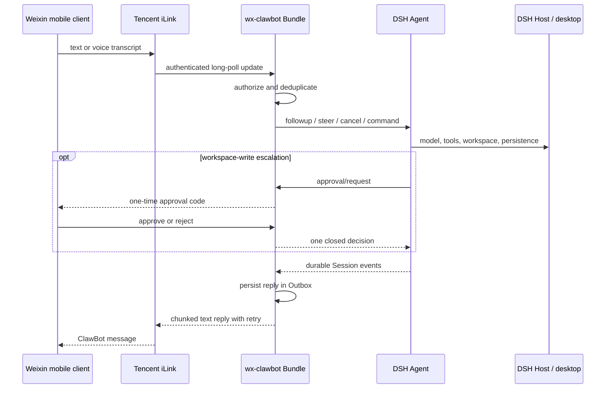

# Architecture and compatibility

[中文](ARCHITECTURE.zh.md) | [English README](README.en.md)

## Data flow

The connector is a host-only Cordis Bundle. It has no Web client module,
desktop injection, local Weixin dependency, startup entry, or system service.

## Ownership and concurrency

- One peer record exists per `bot account + authorized Weixin user`.
- Each peer owns an isolated index of at most 50 persistent DSH Session IDs.
- Ordinary messages are serialized per user; different users can run in
  parallel. Fast task and approval commands bypass that queue.
- When Web or desktop already has the same Session live, the connector borrows
  the Agent through `ctx.agents.get()` and holds a no-op disposer.
- The approval listener claims only Agents created or resumed by this Bundle.
  For a borrowed Agent it calls the DSH waterfall `next()`, preserving the
  original Web/desktop approval provider.

## Persistence and delivery

`$DSH_HOME/wx-clawbot/state.json` contains account metadata, the iLink cursor,
deduplication keys, allowed-user IDs, owner ID, a bounded audit, durable Outbox,
and peer Session indexes. The bot token is resolved from DSH credentials and is
never serialized into plugin state.

Replies are atomically stored before transmission. Failures use bounded
exponential backoff and survive Host restarts. At most 100 undelivered replies
and 200 audit events are retained. Pairing and approval codes are deliberately
memory-only, single-use, and expire after ten and five minutes respectively.

State version remains `1`; normalization upgrades earlier state in place by
selecting the first existing allowed user as owner and promoting the old direct
`sessionId` into `sessions[]`.

## DSH compatibility

Stable services provide Agent creation, persistence, Presets, model selection,
permissions, approval, and system prompts. Optional services are detected with
`ctx.get()`:

| Optional service | Enhanced behavior | Fallback |
| --- | --- | --- |
| `sessionTitle` | Durable DSH title events | Local connector title |
| `workspaceRegistry` | Host-wide archive state | Connector-local archive |
| `commands` | Native slash commands | Clear unknown-command reply |
| `llm` | Provider discovery and validation | Stored/default selection |

DSH `0.1.1-rc.2` was verified by installing the packed Bundle into an official
Web profile, dumping the composed configuration, booting the host, and testing
the approval waterfall. `0.1.0-rc.8` remains in the declared compatibility
range for the pre-approval feature surface.

`userQuestions` permits one Provider, already owned by Web/desktop. The Bundle
therefore does not register another `ask_user_question` provider. A phone-owned
Agent is instructed to ask for missing information in its ordinary final reply
and finish that turn.
