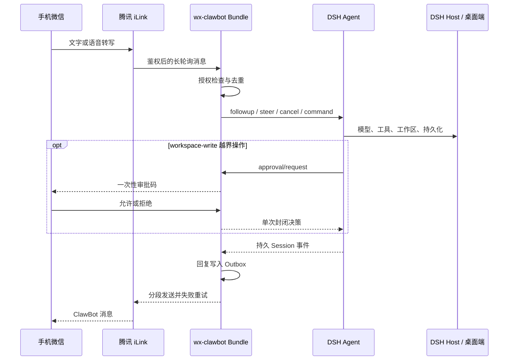

# 架构与兼容性

[English](ARCHITECTURE.md) | [中文首页](../README.md)

## 数据流

插件是纯 Host 侧 Cordis Bundle，不包含 Web 页面、桌面注入、本地微信依赖、开机
启动项或系统服务。

## 所有权与并发

- 每个“Bot 账号 + 授权微信用户”对应一条独立 peer 记录。
- 每个 peer 最多索引 50 个持久 DSH Session，用户之间相互隔离。
- 普通消息按用户串行，不同用户可并行；任务快命令和审批命令绕过普通队列。
- Web/桌面端已打开同一 Session 时，通过 `ctx.agents.get()` 借用 Agent，并使用空
  disposer，不会释放其他界面拥有的 Agent。
- 审批监听器只认领插件自己创建或恢复的 Agent。借用 Agent 时调用 DSH waterfall
  的 `next()`，继续使用原 Web/桌面审批 Provider。

## 持久化与发送

`$DSH_HOME/wx-clawbot/state.json` 保存账号元数据、iLink 游标、去重键、授权用户、
主用户、有限审计、持久 Outbox 和 peer Session 索引。Bot Token 每次从 DSH
credential provider 读取，不写入插件状态。

回复发送前先原子写入状态，失败后按有上限的指数退避重试，Host 重启后继续。最多
保留 100 条未送达回复和 200 条审计事件。配对码与审批码只在内存中保存，只能使用
一次，分别在 10 分钟和 5 分钟后失效。

状态版本仍为 `1`。旧状态加载时会把已有授权列表的首位修复为主用户，并把早期
直接保存的 `sessionId` 原位迁移到 `sessions[]`。

## DSH 兼容策略

Agent 创建、持久化、Preset、模型选择、权限、审批和系统提示使用稳定服务边界；
以下可选服务通过 `ctx.get()` 能力探测：

| 可选服务 | 增强能力 | 缺失时 |
| --- | --- | --- |
| `sessionTitle` | 持久 DSH 标题事件 | 使用插件本地标题 |
| `workspaceRegistry` | Host 全局归档状态 | 仅插件内归档 |
| `commands` | DSH 原生斜杠命令 | 明确回复未知命令 |
| `llm` | Provider 发现与校验 | 使用已存/默认选择 |

DSH `0.1.1-rc.2` 已通过官方 Web Profile 安装打包产物、配置合成、Host 启动和
审批 waterfall 验证。`0.1.0-rc.8` 继续保留在审批功能之前的兼容范围中。

`userQuestions` 只允许一个 Provider，而 Web/桌面端已经占用。插件不会注册第二个
`ask_user_question` Provider；手机 Agent 需要补充信息时，会用普通最终回复提问并
结束当前轮次。
