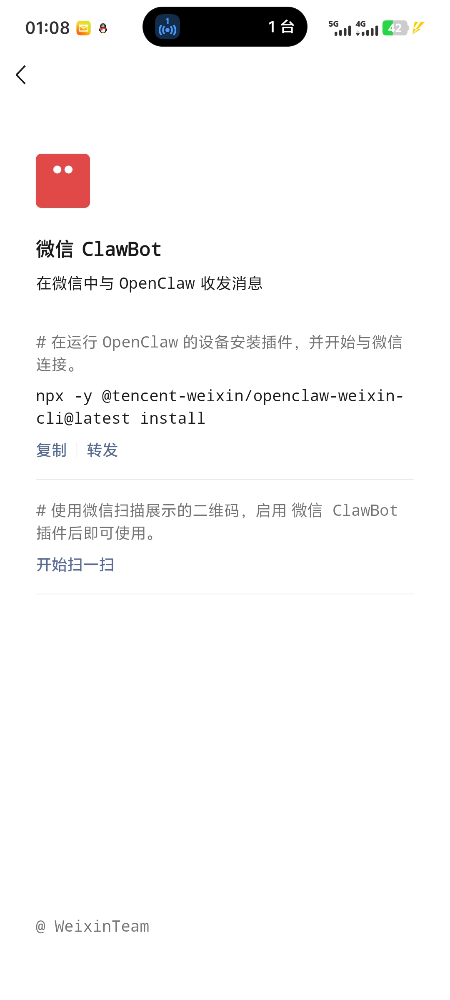
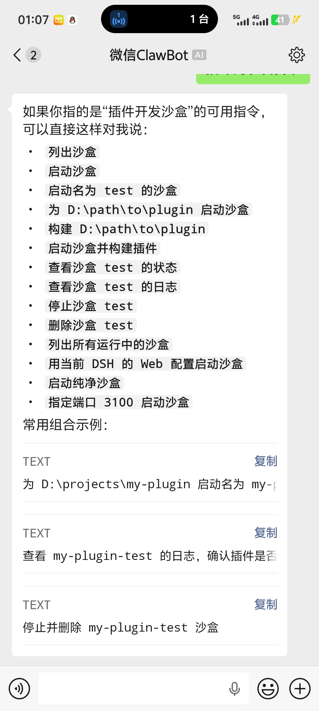
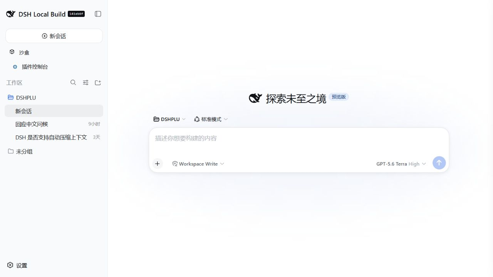

# DSH Weixin ClawBot

[中文](../README.md) | [Setup guide (中文)](GUIDE.zh.md) | [Command reference](COMMANDS.md) | [Architecture and compatibility](ARCHITECTURE.md) | [Security policy](../SECURITY.md)

An independent DeepSeek Harness (DSH) Host Bundle that connects Tencent's
official Weixin ClawBot/iLink channel directly to DSH. After pairing, an
authorized user can submit computer tasks from Weixin, manage persistent
Sessions, choose models and permissions, and steer or cancel a running task.

```text
Phone Weixin -> Tencent iLink -> wx-clawbot Bundle -> DSH Agent -> computer tools/workspace
```

The project does not modify DSH core, inject desktop Weixin, depend on WxHook,
or add a Web page. All remote control uses text commands. Original Web and
desktop DSH can remain open and continue the same Session.

> [!IMPORTANT]
> This is an independent community integration, not an official Tencent,
> Weixin, DeepSeek, or DeepSeek Harness project. Tencent's official
> `@tencent-weixin/openclaw-weixin-cli` targets OpenClaw. DSH users should use
> this repository's Bundle installation and `wx-clawbot setup` pairing flow.

## Agent Skill and registries

The repository also ships a portable Agent Skill that helps Codex, Claude Code,
Cursor, OpenClaw, and other compatible clients install, update, validate, and
troubleshoot this bridge correctly. The Skill contains instructions and safety
constraints only. It contains no Weixin token, pairing QR, or local state, and
does not misrepresent the DSH Bundle as a native OpenClaw code plugin.

Install it through a [skills.sh](https://skills.sh)-compatible client:

```powershell
npx skills add zp-home/wx-clawbot --skill wx-clawbot
```

OpenClaw can use the same index source:

```powershell
openclaw skills install skills-sh:zp-home/wx-clawbot/wx-clawbot
```

The source is
[`skills/wx-clawbot/SKILL.md`](../skills/wx-clawbot/SKILL.md).
The Skill and the Bundle loaded by DSH are separate deliverables: installing
the Skill does not install or pair the Weixin bridge itself.

## Features

- Submit natural-language tasks to DSH from a phone.
- Give each authorized Weixin user an isolated list of persistent Sessions that
  can be created, selected, renamed, and archived.
- Let `/cancel` and `/steer` bypass the ordinary message queue and affect a
  running task immediately.
- Acknowledge tasks immediately and report progress, queue depth, and channel
  health from the phone.
- Let the owner invite or revoke users and inspect a bounded authorization
  audit log.
- Approve or reject one `workspace-write` escalation from Weixin with an
  expiring one-time code.
- Inspect or change the model and select the Agent Preset and workspace for the
  next Session.
- Switch a Session between `workspace-write` and explicitly confirmed
  `danger-full-access`.
- Forward unknown slash commands such as `/plan`, `/goal`, and `/compact` to
  DSH's native command system.
- Reuse an Agent already opened by Web or desktop DSH without taking ownership,
  creating duplicates, or releasing it incorrectly.
- Restore the iLink cursor, user mapping, and DSH Session mapping after a host
  restart.

## Screenshots

<table>
  <tr>
    <td width="50%"></td>
    <td width="50%"></td>
  </tr>
  <tr>
    <td align="center">Official Weixin ClawBot entry and iLink pairing</td>
    <td align="center">Submit a task from the phone and receive DSH results</td>
  </tr>
</table>



The computer still runs the original DSH workspace. A persistent Session
created from the phone can be continued by a Web or desktop host; DSH itself
continues to provide models, tools, sandboxing, and Session persistence.

## Compatibility

- Verified with DSH `0.1.0-rc.8` and `0.1.1-rc.2`.
- Supports DSH Web Host and DSH Desktop Host; the Bundle runs only on the host.
- Supports Windows, macOS, and Linux with Node.js 22.19.0 or newer.
- Requires a persistent host. A one-shot `headless` process cannot maintain the
  iLink long poll after it exits.
- Receives text and Weixin voice transcripts. Images and files require
  Tencent's CDN AES media path and are not treated as ordinary text yet.

New DSH services such as `sessionTitle`, `workspaceRegistry`, `commands`, and
`llm` are connected through runtime capability detection. If an optional
service is absent, the related feature degrades without preventing the channel
from starting.

## Installation

### Quick install from GitHub

With a global `dsh` CLI, install the public repository directly into the
original Web profile:

```powershell
dsh plugin --profile web add github:zp-home/wx-clawbot
```

For DSH Desktop, replace `web` with the profile that build actually starts,
then continue with the pairing step below. For a reproducible pinned version,
install the `.tgz` attached to a GitHub Release instead of tracking the moving
`main` branch.

### 1. Fetch and package

```powershell
git clone https://github.com/zp-home/wx-clawbot.git
cd wx-clawbot
npm ci --legacy-peer-deps
npm test
npm pack
```

### 2. Install into a DSH profile

With a global `dsh` CLI:

```powershell
dsh plugin --profile web add --force .\local-wx-clawbot-0.3.0.tgz
```

When running a DSH source checkout directly:

```powershell
cd D:\path\to\deepseek-harness
node --import tsx/esm apps/cli/src/bin.ts plugin --profile web add --force D:\path\to\wx-clawbot\local-wx-clawbot-0.3.0.tgz
```

For a desktop build, replace `web` with the profile that build actually starts.
The Bundle and configuration are unchanged; desktop source code does not need
to be modified.

On Windows, prefer installing the `.tgz`. Some DSH/pnpm combinations resolve an
absolute `link:D:/path/to/plugin` as an invalid link.

### 3. Pair Weixin

Run setup from the workspace that DSH should operate:

```powershell
cd D:\your-workspace
D:\path\to\wx-clawbot\node_modules\.bin\wx-clawbot.cmd setup --agent-cwd D:\your-workspace
```

The terminal displays a QR and writes a local copy to
`$DSH_HOME/wx-clawbot/pairing-qr.png`. Scan it with Weixin and confirm the
pairing. The returned token is stored through the DSH credential provider, not
in plugin state.

Check local status:

```powershell
D:\path\to\wx-clawbot\node_modules\.bin\wx-clawbot.cmd status
```

Restart the persistent DSH host and send `/status` in Weixin.

To unpair this computer and delete its locally stored token:

```powershell
wx-clawbot disconnect
```

Remove the Bundle from the profile:

```powershell
dsh plugin --profile web remove @local/wx-clawbot
```

Removing the Bundle does not delete workspace content. Run
`wx-clawbot disconnect` first when the local Weixin pairing should also be
removed.

## Phone commands

| Command | Purpose |
| --- | --- |
| `/sessions` | List the current Weixin user's unarchived Sessions. |
| `/use <number-or-short-id>` | Switch to an existing Session. |
| `/new [title]` | Keep the old Session and create a new one. |
| `/rename <title>` | Rename the current Session. |
| `/archive [number-or-short-id]` | Archive a selected or current Session. |
| `/archive-all confirm` | Archive all unarchived Sessions owned by this user. |
| `/search <query>` | Search unarchived Sessions by title, ID, or workspace. |
| `/cancel` | Immediately cancel the running task. |
| `/steer <instruction>` | Append a correction at the next DSH step boundary. |
| `/task` / `/queue` / `/doctor` | Inspect the task, queue, and channel health. |
| `/model [provider/model]` | Show or change the current Session model. |
| `/preset [id]` | Show or select the Preset for the next new Session. |
| `/permission workspace-write` | Use the workspace write sandbox. |
| `/permission danger-full-access confirm` | Explicitly grant full machine access to this Session. |
| `/approve <code>` / `/reject <code>` | Decide one pending `workspace-write` operation. |
| `/users` / `/invite` / `/revoke ... confirm` | Manage authorized users as the owner. |
| `/audit [1-20]` | Show recent security audit events as the owner. |
| `/cwd [path]` | Show or set the workspace for the next new Session. |
| `/status` | Show Session, task, workspace, Preset, permission, and model. |
| `/help` | Show the phone command summary. |

See the [command reference](COMMANDS.md) for complete semantics and examples.

## Security model

- The first account to pair becomes the owner. It can issue a one-use,
  ten-minute code that authorizes another user. Unknown senders are dropped
  before Agent resolution.
- Session indexes are isolated per Weixin user; a short ID cannot select
  another user's Session.
- The default is `workspace-write`. A wider operation sends the owning Weixin
  user a five-minute one-time approval code. Timeout, cancellation, and channel
  failure all fail closed.
- The bridge claims approval only for Agents it created or resumed. Approval for
  an Agent borrowed from Web or desktop continues to the original surface.
- Full machine access requires the exact command
  `/permission danger-full-access confirm`. A new Session restores the
  configured default permission.
- State does not contain the bot token, but it does contain the iLink cursor,
  allowed user ID, and Session mapping, so it must still be treated as private.
- Never commit `$DSH_HOME/.credentials.yaml`, `state.json`, a pairing QR, or
  unredacted logs.

Read the [security policy](../SECURITY.md) and
[architecture notes](ARCHITECTURE.md) for details.

## Configuration

The default Bundle configuration is in `cordis.patch.yml`:

| Field | Meaning |
| --- | --- |
| `stateDir` | State directory; defaults to `$DSH_HOME/wx-clawbot`. |
| `credentialRef` | DSH credential reference; defaults to `WX_CLAWBOT_BOT_TOKEN`. |
| `agentCwd` | Default absolute workspace for phone-created Agents. |
| `agentPreset` | Default Agent Preset for a new user or Session. |
| `permissionPreset` | `workspace-write` or deployment-level explicit `danger-full-access`. |
| `maxReplyChars` | Maximum characters per Weixin reply; longer output is segmented. |
| `turnTimeoutSeconds` | Maximum duration of a phone task. |
| `pollTimeoutSeconds` | Initial iLink long-poll timeout. |
| `progressIntervalSeconds` | Long-task progress interval; defaults to 90 seconds. |
| `taskAcknowledgements` | Whether an ordinary task receives an immediate acknowledgement. |
| `systemPrompt` | Extra Agent system prompt for the Weixin channel. |

DSH patch configuration replaces complete values. When overriding the
`wx-clawbot` configuration, rewrite every field that must be preserved.

## Development

```powershell
npm ci --legacy-peer-deps
npm run check
npm test
npm pack
```

Tests cover the iLink protocol wrapper, Unicode segmentation, credential-file
preservation, Agent reply folding, old-state migration, multi-Session cleanup,
command parsing, authorization audit, durable outbox behavior, and one-time
approval lifecycle.

The project intentionally does not install Windows startup entries, scheduled
tasks, or system services. The user starts the persistent DSH Web or desktop
host through their existing workflow.

Read [CONTRIBUTING.md](../CONTRIBUTING.md) before contributing. Protocol sources
and third-party notices are documented in
[THIRD_PARTY_NOTICES.md](../THIRD_PARTY_NOTICES.md).

## License and disclaimer

The Bundle source is distributed under the [MIT License](../LICENSE). The
portable Agent Skill has its own MIT-0 license as required by ClawHub.

Weixin and ClawBot are trademarks of their respective owners. This repository
is an independent community integration.
